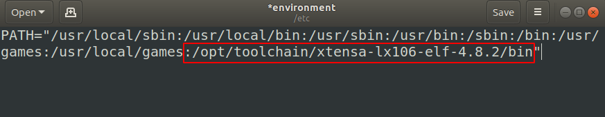

# toolchain
常用交叉编译器收录

## 交叉编译器环境变量设置方法

```shell
# !1 解压文件目录到/opt/toolchain/  (个人习惯，喜欢放在这里)
toolchain$ sudo tar -axf xtensa-lx106-elf-4.8.2.tar.gz -C /opt/toolchain/
# !2 确定可执行文件路径，执行查看版本号
toolchain$ /opt/toolchain/xtensa-lx106-elf-4.8.2/bin/xtensa-lx106-elf-gcc -v
Using built-in specs.
COLLECT_GCC=/opt/toolchain/xtensa-lx106-elf-4.8.2/bin/xtensa-lx106-elf-gcc
COLLECT_LTO_WRAPPER=/opt/toolchain/xtensa-lx106-elf-4.8.2/bin/../libexec/gcc/xtensa-lx106-elf/4.8.2/lto-wrapper
Target: xtensa-lx106-elf
Configured with: /opt/xte/crosstool-NG/.build/src/gcc-4.8.2/configure --build=x86_64-build_unknown-linux-gnu --host=x86_64-build_unknown-linux-gnu --target=xtensa-lx106-elf --prefix=/opt/xte/crosstool-NG/builds/xtensa-lx106-elf --with-local-prefix=/opt/xte/crosstool-NG/builds/xtensa-lx106-elf/xtensa-lx106-elf/sysroot --disable-libmudflap --with-sysroot=/opt/xte/crosstool-NG/builds/xtensa-lx106-elf/xtensa-lx106-elf/sysroot --with-newlib --enable-threads=no --disable-shared --with-pkgversion='crosstool-NG 1.20.0' --disable-__cxa_atexit --with-gmp=/opt/xte/crosstool-NG/.build/xtensa-lx106-elf/buildtools --with-mpfr=/opt/xte/crosstool-NG/.build/xtensa-lx106-elf/buildtools --with-mpc=/opt/xte/crosstool-NG/.build/xtensa-lx106-elf/buildtools --with-isl=/opt/xte/crosstool-NG/.build/xtensa-lx106-elf/buildtools --with-cloog=/opt/xte/crosstool-NG/.build/xtensa-lx106-elf/buildtools --with-libelf=/opt/xte/crosstool-NG/.build/xtensa-lx106-elf/buildtools --enable-lto --enable-target-optspace --disable-libgomp --disable-libmudflap --disable-nls --disable-multilib --enable-languages=c
Thread model: single
gcc version 4.8.2 (crosstool-NG 1.20.0)
```
```shell
#  !3 设置环境变量  (个人习惯，喜欢设置这个文件)，新增如下图红框内内容，保存
toolchain$ sudo gedit /etc/environment
```


```shell
# !4 让修改的配置文件生效
toolchain$ source /etc/environment
```
